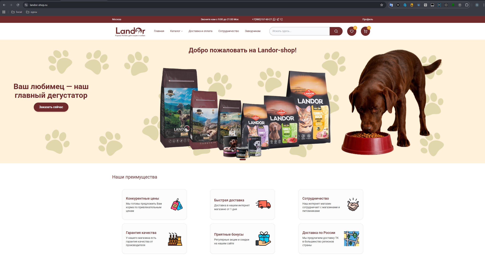
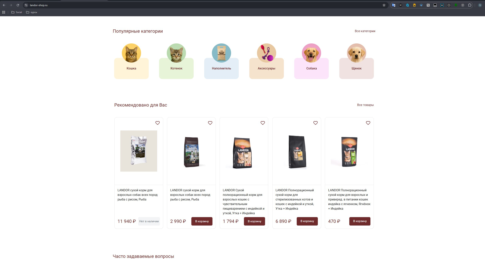
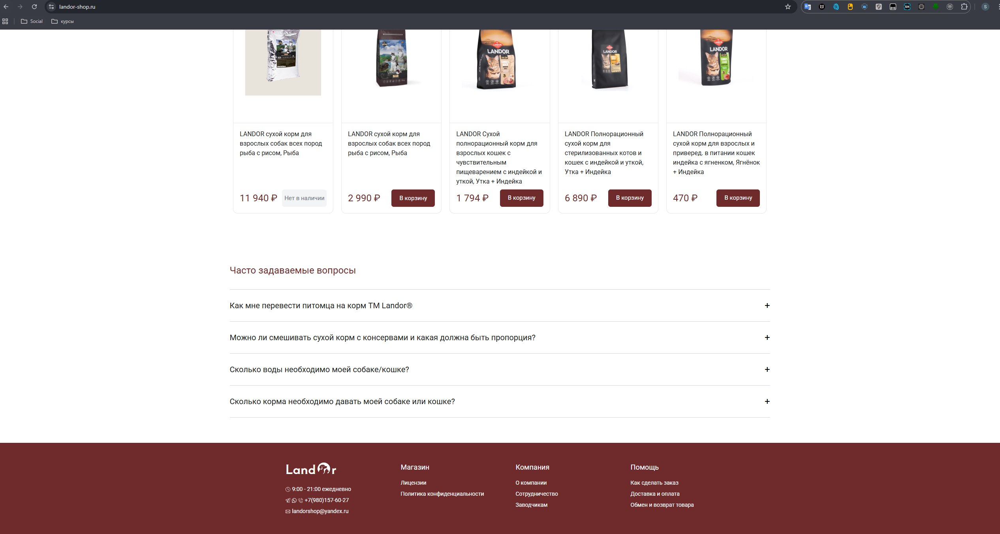
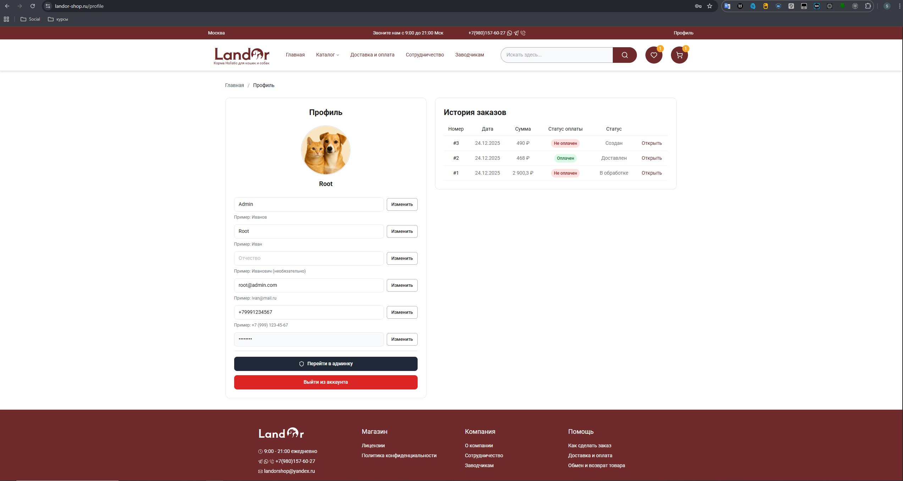
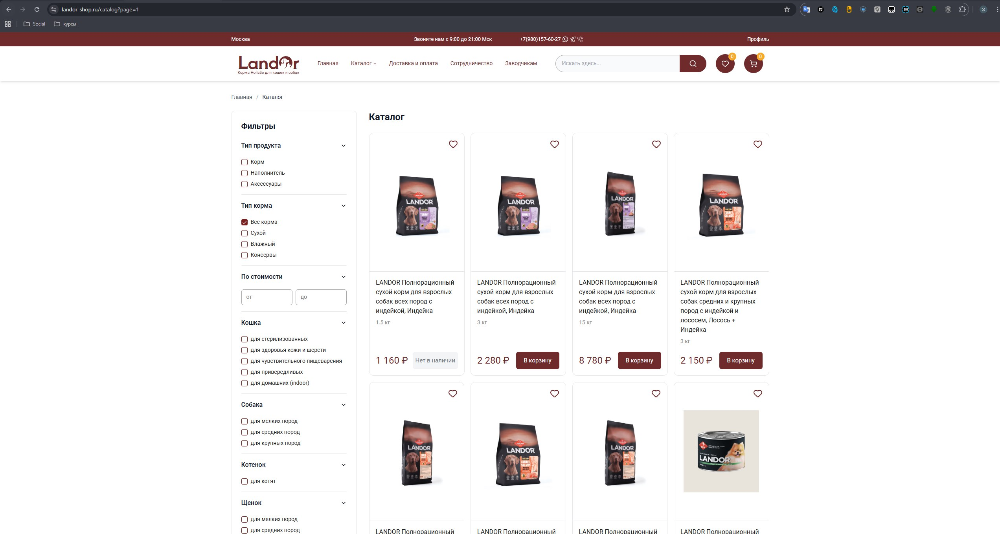
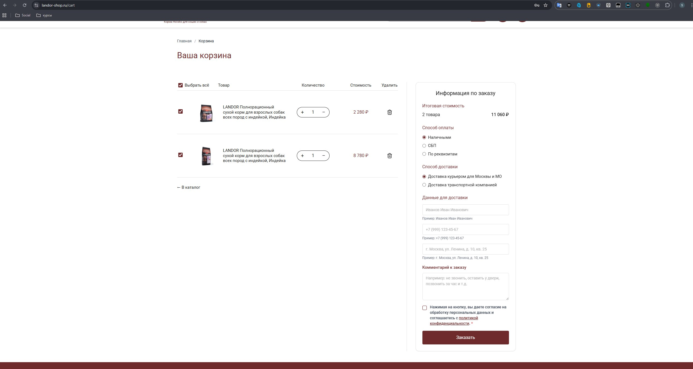
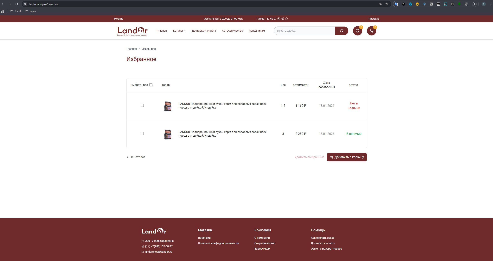
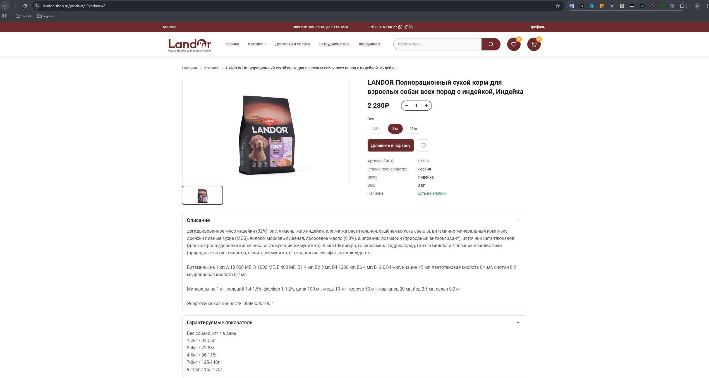
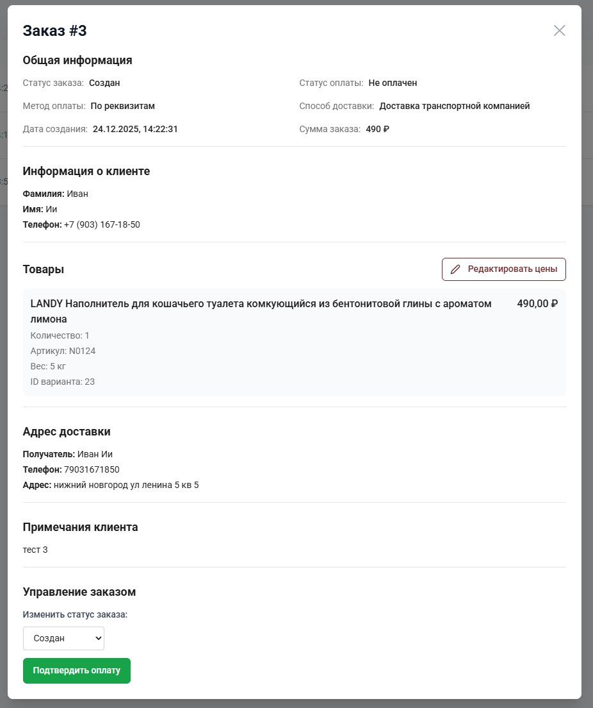
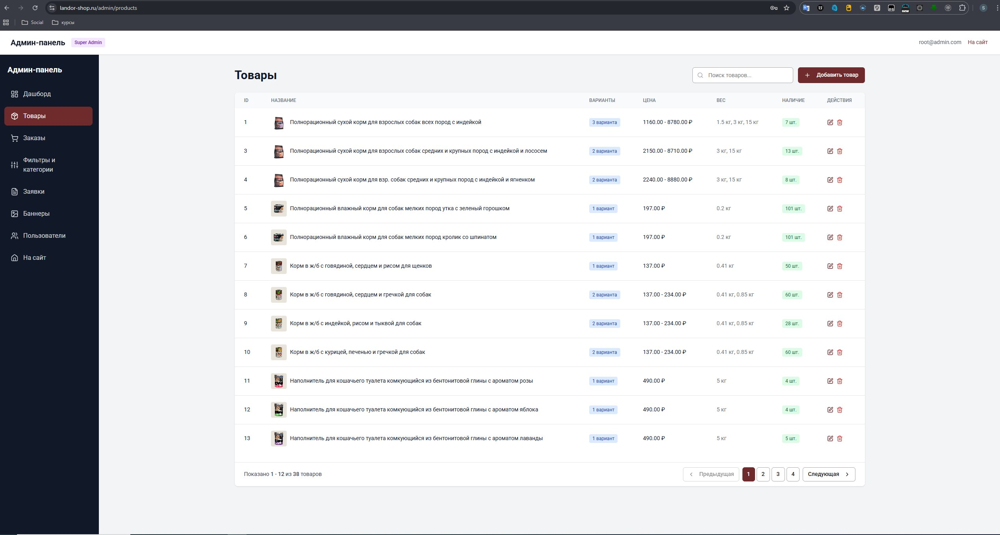

# 🛍️ Landor Shop


Полнофункциональное веб-приложение для электронной коммерции с современным интерфейсом и надежным бэкэндом.

---

## 📸 Скриншоты

### Главная страница





### Профиль клиента



### Каталог продуктов



### Корзина покупок



### Избранные товары



### Страница товара



### Модальное окно заказа



### Панель администратора(товары)



---

## ✨ Основные возможности

### 🛒 Для пользователей

- ✅ Просмотр каталога товаров с фильтрацией и поиском
- ✅ Система рекомендаций товаров
- ✅ Безопасная аутентификация и авторизация
- ✅ Управление корзиной покупок
- ✅ Сохранение избранных товаров
- ✅ Профиль пользователя с историей заказов
- ✅ Информация о доставке и способах оплаты
- ✅ Система уведомлений

### 👨‍💼 Для администраторов

- ✅ Управление каталогом товаров
- ✅ Управление заказами
- ✅ Аналитика и отчеты
- ✅ Управление пользователями
- ✅ Настройки магазина

### 🎨 Особенности интерфейса

- ✅ Адаптивный дизайн (мобильные, планшеты, десктоп)
- ✅ Темная/светлая тема
- ✅ Плавные анимации и переходы
- ✅ Быстрая загрузка страниц
- ✅ SEO оптимизированный

---

## 🔧 Технологический стек

### 🎨 Frontend

| Технология          | Версия | Описание                               |
| ------------------- | ------ | -------------------------------------- |
| **React**           | 19+    | Библиотека для создания UI             |
| **Vite**            | Latest | Быстрый build инструмент               |
| **TailwindCSS**     | 3.4+   | Утилитарный CSS фреймворк              |
| **Radix UI**        | Latest | Компоненты с доступностью              |
| **React Query**     | 5.84+  | Управление состоянием серверных данных |
| **React Hook Form** | 5.2+   | Управление формами                     |
| **Framer Motion**   | Latest | Библиотека анимаций                    |
| **Vitest**          | Latest | Unit тестирование                      |

### 🔧 Backend

| Технология            | Версия | Описание                          |
| --------------------- | ------ | --------------------------------- |
| **Java**              | 17 LTS | Язык программирования             |
| **Spring Boot**       | 3.3.5  | Фреймворк для создания приложений |
| **Spring Security**   | 6.x    | Безопасность и аутентификация     |
| **Spring Data JPA**   | Latest | Работа с БД                       |
| **PostgreSQL**        | Latest | Реляционная БД                    |
| **JWT**               | 0.11.5 | Токены аутентификации             |
| **Flyway**            | Latest | Миграции БД                       |
| **SpringDoc OpenAPI** | 2.5.0  | API документация (Swagger)        |

### 🐳 DevOps

- **Docker** - контейнеризация приложения
- **Docker Compose** - оркестрация сервисов
- **PostgreSQL** - основная БД

---

## 🚀 Быстрый старт

### Требования

- Java 17+
- Node.js 16+
- Docker & Docker Compose (опционально)
- PostgreSQL 14+ (если без Docker)

## 📁 Структура проекта

```
landor-shop/
├── frontend/                      # React приложение
│   ├── client/
│   │   ├── components/           # React компоненты
│   │   │   ├── ui/               # UI компоненты (Radix)
│   │   │   └── admin/            # Компоненты админ панели
│   │   ├── pages/                # Страницы приложения
│   │   ├── hooks/                # Кастомные React hooks
│   │   ├── utils/                # Утилиты и хелперы
│   │   └── App.jsx
│   ├── public/                   # Статические файлы
│   ├── package.json
│   ├── vite.config.js
│   └── tailwind.config.js
│
├── backend/                       # Java/Spring Boot приложение
│   ├── src/
│   │   ├── main/java/com/        # Java исходный код
│   │   │   ├── controller/       # REST контроллеры
│   │   │   ├── service/          # Бизнес-логика
│   │   │   ├── repository/       # Работа с БД
│   │   │   ├── dto/              # Data Transfer Objects
│   │   │   ├── entity/           # JPA сущности
│   │   │   ├── config/           # Конфигурация
│   │   │   └── security/         # JWT и безопасность
│   │   └── resources/
│   │       ├── application.properties
│   │       └── db/migrations/    # Flyway миграции
│   ├── build.gradle
│   └── Dockerfile
│
├── docker-compose.yml            # Конфигурация Docker
└── README.md                      # Этот файл
```

---

## 📊 Производительность

- ⚡ **Frontend**: Lighthouse Score 95+
- 📱 **Mobile**: Оптимизировано для мобильных устройств
- 🔒 **Security**: HTTPS, CORS, CSRF защита

---

## 📄 Лицензия

Этот проект распространяется под лицензией MIT. Подробнее смотрите [LICENSE](LICENSE).
